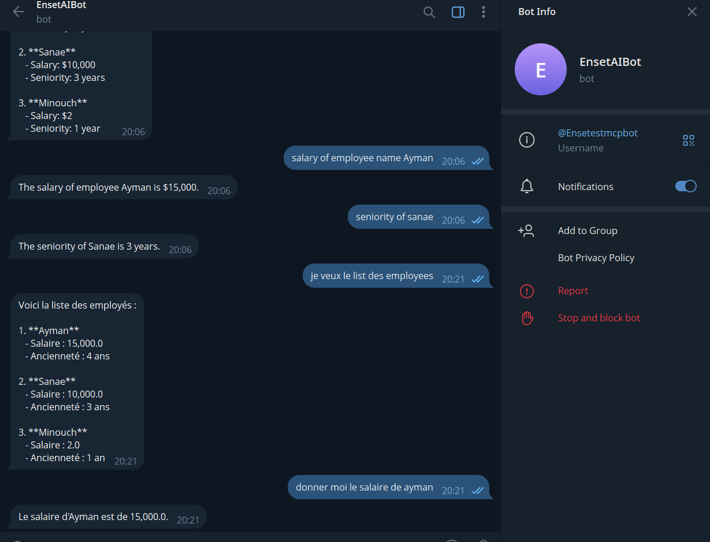

# 🤖 Enset Bot Telegram – Projet Java Spring Boot

Ce projet est une application intelligente composée de deux modules : `enset-bot` (bot Telegram avec agents IA) et `mcp-server` (serveur de traitement et d'orchestration). Il est développé en Java avec Spring Boot et Maven.

